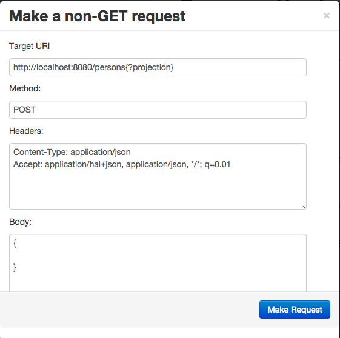

# HAL-browser

An API browser for the hal+json media type

# Example Usage

Here is an example of a hal+json API using the browser:

[http://haltalk.herokuapp.com/explorer/browser.html](http://haltalk.herokuapp.com/explorer/browser.html)

# About HAL

HAL is a format based on json that establishes conventions for
representing links. For example:

```javascript
{
    "_links": {
        "self": { "href": "/orders" },
        "next": { "href": "/orders?page=2" }
    }
}
```

More detail about HAL can be found at
[http://stateless.co/hal_specification.html](http://stateless.co/hal_specification.html).

# Instructions

All you should need to do is copy the files into your webroot.
It is OK to put it in a subdirectory; it does not need to be in the root.

All the JS and CSS dependencies come included in the vendor directory.

# Customizing Options

## Altering the non-GET dialog

Out-of-the-box, the HAL Browser allows users to create new resources through a dialog box, as shown below:



Because the HAL Browser has no metadata to describe the resources, it requires the user to enter a raw JSON document in the `Body` field. This requires users to know all the right fields.

If you have some form of metadata (such as an ALPS micro-document), you can plug in your own logic and render a more user-friendly dialog with each attribute listed.

The following fragment of JavaScript shows the API to plugin your own solution:
```javascript
HAL.customPost = {

	renderForm: function(href, callback) {
		// 1. var results = /* array of attribute names ["firstName", "lastName"] */
		// 2. invoke callback(results)
	},

	extractData: function(attributes) {
		// 1. Use the array of attributes and  extract input values from your custom
		//    dialog.
		// 2. Convert into a properly stringified JSON document
	}
}
```

* `renderForm` supports fetching through a promise by letting you call `callback(results)` from `then()` or `done()` if needed.
* `extractData` is used to pull input values from the dialog and convert into a stringified JSON document to be sent to the server for resource creation.

To plug in your own code and use the attributes, you'll have to write an alternative `browser.html`.

1. Include your own JavaScript module that implements `HAL.customPost`, whether that is with `<script>` tags or your favorite module loader.
1. Replace/supplement the existing dialog found in `browser.html`:

```html
  <script id="non-safe-request-template" type="text/template">
    <div class="modal-header">
      <button type="button" class="close" data-dismiss="modal" aria-hidden="true">&times;</button>
      <h3>Make a non-GET request</h3>
    </div>

    <form class="non-safe" action="<%= href %>">
      <div class="modal-body">
        <p>Target URI</p>
        <input name="url" type="text" class="url" value="<%= href %>" />
        <p>Method:</p>
        <input name="method" type="text" class="method" value="POST" />
        <p>Headers:</p>
<textarea name="headers" class="headers" style="height: 100px">
Content-Type: application/json
<%= user_defined_headers %>
</textarea>
        <p>Body:</p>
<textarea name="body" class="body" style="height: 200px">
{

}
</textarea>
      </div>

      <div class="modal-footer">
        <button type="submit" class="btn btn-primary">Make Request</button>
      </div>
    </form>
  </script>
```

* The `<p>Body</p><textarea>...` fragment is the part you will want to replace.

# TODO

* Provide feedback to user when there are issues with response (missing
self link, wrong media type identifier)
* Give 'self' and 'curies' links special treatment
